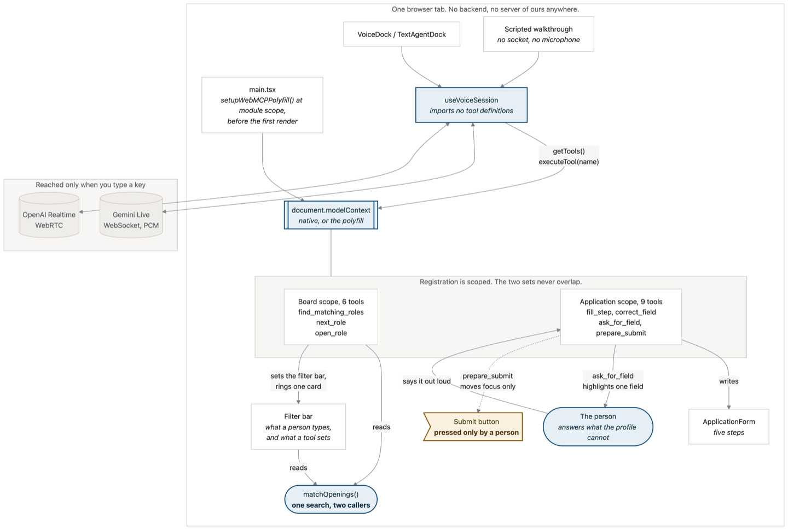

# VocalApply

A careers site for **VocalApply**, an invented speech-recognition company. Nine openings on a
board, a five-step application behind each one, and an agent that searches the board, opens a role
and fills the form by talking to you.

It stops at the submit button, and it stops there because there is no tool that presses it.

**Live:** [vocalapply.trustvalidated.com](https://vocalapply.trustvalidated.com) ·
**Selector resilience:** [?tdd=1](https://vocalapply.trustvalidated.com/?tdd=1)

---

## Try it in thirty seconds

Nothing to install. Open the live site and pick one:

| | |
| :--- | :--- |
| **No key** | Press **Start with shared credit** in the Voice dock, on either provider. No key is ever in the page. OpenAI works by the server minting a short-lived token, after which your browser talks to OpenAI directly. Gemini has no token that works on its Live socket, so that session is relayed through this site's server instead — which means the audio passes through it, and the page says so before the microphone opens. |
| **No key, no microphone** | Press **No key? Play the walkthrough**. A rehearsed run through the same tools, narrated by your browser. It cannot answer a question. |
| **Your own key** | Paste an OpenAI or Gemini key. It goes straight to the provider and never touches our server. |

Then say:

- *"What have you got open?"* — it searches, sets the filter bar in front of you, and reads the top match
- *"Not that one."* — it rings the next card and reads that instead
- *"Apply to that one."* — opens the role and its form
- *"Fill it in."* — fills everything the profile holds, then highlights the one question it cannot answer and asks you
- *"My salary went up."* — corrected, and remembered in this browser for next time
- *"Submit it."* — it will not, and it will say why

Headphones help: half duplex is the default, and on laptop speakers the model hears itself and
interrupts itself. Tick **barge-in** in the live setup to talk over it mid-sentence.

---

## Run it locally

```bash
npm install
npm run dev        # vite on http://localhost:3200, does not open a browser
```

That is enough for the walkthrough, the board, the whole form and the `?tdd=1` page. **No API key is
needed for any of it.**

For a live model, either paste a key into the page at runtime, or put one in a `.env` to prefill the
field while developing:

```bash
cp .env.example .env
```

| Variable | What it does |
| :--- | :--- |
| `VITE_OPENAI_API_KEY` | Prefills the OpenAI key field. **Dev only** — the build strips it. |
| `VITE_GEMINI_API_KEY` | Same, for Gemini. |
| `VITE_OPENAI_REALTIME_MODEL` / `VITE_GEMINI_LIVE_MODEL` | Swap a retired model id without a code change. |
| `VITE_POSTHOG_KEY` | Omit it and analytics is a no-op. |

Vite inlines every `VITE_*` value into the bundle. The two key prefills are safe only because they
sit behind `import.meta.env.DEV`, which makes them dead code in a build. **Any new `VITE_*` you add
without that guard ships to every visitor.** `scripts/scan-dist-for-secrets.sh` fails the build if
one does.

Other commands:

```bash
npm run build      # tsc -b && vite build — the only type check in this project
npm run preview    # serve the built dist/
```

---

## Check it still works

```bash
cd verify && npm install       # puppeteer-core only; it ships no browser

# Serve a build first: npm run build && npx vite preview --port 3230 --host 127.0.0.1
CHROME="/Applications/Google Chrome.app/Contents/MacOS/Google Chrome" node voice-scope-verify.mjs
URL=http://127.0.0.1:3230 node voice-audio-verify.mjs
URL=http://127.0.0.1:3230 node voice-shared-credit-verify.mjs
```

| Script | Asserts |
| :--- | :--- |
| `voice-scope-verify.mjs` | the board-to-application handover: the swap fires `toolchange`, the application scope registers `fill_step`, values reach the DOM, and — with the socket stubbed, so no key and no microphone — the live session is re-opened and its *second* `setup` declares the form tools the first one could not |
| `voice-audio-verify.mjs` | the playback path, measured: a 440 Hz sine in 20 ms chunks scheduled the way the model's audio is. 15.7x the sine's own steepest slope through a 44.1 kHz context, 1.0x when playback is pinned to the model's 24 kHz. Asserts the broken case stays broken, so the probe cannot quietly stop measuring anything |
| `voice-shared-credit-verify.mjs` | both shared-credit routes with an **empty** key field, and that neither long-lived key is in the served bundle. Needs no key of its own |
| `voice-session-reset-verify.mjs` | what a session end clears and what it must not: a bulk fill goes, a spoken correction stays, a reload opens on the correction alone, and the internal re-open on a tool-scope change does **not** count as an end |

There is no test runner here. Those three, plus four self-checks that run at boot in the deployed
build as well as in dev, are what stands in for one.

---

## Deploying

`npm run build` produces a static `dist/`, so any static host will serve it. What the host has to
get right is in [`deploy/Caddyfile.example`](deploy/Caddyfile.example), which is the deployed
config with the hostname parameterised. Four things matter:

- **`Permissions-Policy: tools=(self)`** is what permits WebMCP at all. Set it to `tools=()` and
  every tool silently fails to register: the page looks merely broken, with nothing in the console
  saying why. `Origin-Agent-Cluster: ?1` goes with it.
- **`connect-src` must list every origin the page calls**, and `wss:` is a separate source
  expression from `https:` under CSP3 scheme matching — one does not cover the other. A missing
  origin fails *only* in production, because the dev server sets no CSP, and it surfaces as
  `TypeError: Failed to fetch` with no mention of CSP. `api.openai.com` was missing for the whole
  life of the OpenAI path.
- **`/pcm-processor.js` must not be cached immutably.** Vite content-hashes everything under
  `/assets/` and nothing else; that worklet comes from `public/` unhashed, and a naive
  `*.js → immutable` rule pins a stale audio worklet in returning browsers for a year.
- **The shared-credit keys are the server's, not the bundle's.** They are read from the server
  environment, never from this app's `.env`. Put a hard spend cap on anything you set there: the
  OpenAI mint route and the Gemini relay are both unauthenticated, so anyone who opens the page can
  spend them. Leave them unset and the page simply asks each visitor for their own key.

---
---

# How it works

Everything above is how to use it. Everything below is why it is built this way.

## Architecture



Source: [`docs/architecture.md`](docs/architecture.md), which is the mermaid the image was rendered
from — read that one if the picture and the prose ever disagree.

## The board, and the one search behind it

`src/lib/matchOpenings.ts` **is the search, and it exists once.** The filter bar and the
`find_matching_roles` tool both call it with the same argument shape, because a shortlist an agent
reads out loud has to be reproducible by a person with the controls in front of them. Two
implementations would drift the first time either was tuned.

- **Filters are hard.** Work mode, contract, location, team, keywords, salary and currency each
  remove roles, and `removedBy` reports how many each one took out, so a search that returns nothing
  can be widened instead of abandoned.
- **Profile matching is soft.** It ranks by skills, location and experience and **can never hide a
  role**. A person is allowed to apply for the job the ranking thinks is a stretch.

**The agent's search is the visible one.** `find_matching_roles` sets the filter bar, narrows the
grid and rings the top card; `next_role` walks the ring down the shortlist. Neither is
`readOnlyHint`, because both change what is on screen, and an annotation saying otherwise is a false
claim about the page.

## Two passes, then it asks you

A profile cannot answer everything, so rather than leaving those fields blank:

1. **Fill what it knows.** `fill_step` writes every field the profile holds and reports the rest as
   `unanswerable`.
2. **Ask for the rest, one at a time.** `ask_for_field` opens the step and highlights that field, so
   you can see which question it means before it asks. You answer, `correct_field` writes what you
   said, and the highlight clears. Typing it yourself clears it too.

Today that is `relocation` and *"Why this role, and why now?"* — deliberately a question no profile
should be answering for you.

**The declaration is not one of them.** Both writing tools refuse a checkbox outright. A tool that
can write any field would otherwise tick "I have read this application" on your behalf, which is the
same failure as submitting for you.

## Registration is scoped

The two tool sets never overlap. Browsing a board while being told about `fill_step` describes a
form that is not on screen.

| Scope | Tools |
| :--- | :--- |
| Board (6) | `list_open_roles`, `find_matching_roles`, `next_role`, `open_role`, `get_applicant_profile`, `switch_applicant` |
| Application (9) | `get_application_state`, `list_application_steps`, `open_step`, `fill_step`, `correct_field`, `ask_for_field`, `prepare_submit`, plus the same two shared |

`__toolsSelfCheck()` asserts the registry is **exactly one of those two sets**, so a board that
leaked `fill_step` fails at boot rather than shipping.

## The rule, and it is not negotiable

> **No tool submits, and no spoken instruction can.** `prepare_submit` calls `focus()` and returns
> `submitted: false`. Voice makes "say yes to send it" the obvious next feature, and that feature is
> the one thing this demo exists to refuse.

Measured in a real browser rather than asserted: 18 fields filled, declaration unticked,
`submitted: false`.

## Credentials, and why there is no key in the bundle

This app has no backend, so a key shipped in `dist/` is readable with `curl | grep`. The deployment
keeps its key on the server instead and exposes one route that mints a **short-lived OpenAI token**
from it. A leaked token is worth about a minute.

Only the mint call crosses the box. OpenAI then takes the token directly from the browser, so **no
audio flows through the server** — which matters on two shared vCPUs also running a trading stack.

**Gemini has no shared path, and that is measured rather than assumed.** Its `auth_tokens` mint
happily and then authenticate nothing on the Live socket: `access_token=` and `key=`, the full
`auth_tokens/x` name and the bare id, bound and unbound, on v1beta and v1alpha — every combination
completes the handshake and closes `1008 "unregistered callers"` the moment a message is sent. So
Gemini asks for your own key. Relaying that socket with a key injected would work and is
deliberately not built, because every audio frame would cross that box.

## A second page: selector resilience (`?tdd=1`)

One small feature, refactored four ways, driven three ways.

| Refactor | Recorded selector | `data-testid` | WebMCP tool call |
| :--- | :--- | :--- | :--- |
| As shipped | pass | pass | pass |
| Restyled | **fail** | pass | pass |
| Fields changed | **fail** | **fail** | pass |
| Feature removed | **fail** | **fail** | **fail** |

The claim is narrow and the page says so on screen: it fixes tests that break when markup moves. It
does not help with multi-tab flows, cross-origin logins, parallelism or setup cost, and it does not
replace Playwright or Cypress. No number appears anywhere on it.

Three rows keep it honest. **`data-testid` passes the restyle**, because a team that keeps testids
really is immune to one. The two part company one row lower, where splitting the email field in two
leaves no element for `[data-testid="email"]` to name. And **the last row is the tool call failing,
correctly**, because the feature was withdrawn; without it the page reads as a claim that a tool
call always survives.

A query parameter rather than a route, so neither deploy path needs a `try_files` fallback and it
works over `file://` too.

## Files that are the contract

| File | What it fixes |
| :--- | :--- |
| `src/voice/useVoiceSession.ts` | **The seam that makes the demo mean anything.** It imports no tool definitions, reads `document.modelContext.getTools()`, and dispatches by name through `executeTool`. Never wire declarations directly. |
| `src/voice/liveClient.ts` | Raw WebSocket to Gemini v1beta `BidiGenerateContent`. No SDK, no backend. |
| `src/voice/openaiRealtimeClient.ts` | OpenAI Realtime over WebRTC. `buildSessionUpdate()` is a pure function with `__openaiSelfCheck()` over it, because both of its load-bearing fields fail invisibly until a real key is in play. |
| `src/voice/sharedKey.ts` | The relay path, and why a key is never in the bundle. |
| `src/voice/audio.ts` | 16 kHz up, 24 kHz down, scheduled playback, RMS barge-in. Half duplex by default. |
| `src/voice/scriptedWalkthrough.ts` | The keyless sequence. Beats build their calls from what the previous beat returned, so it opens a role the search actually returned and derives the salary correction from the profile's own pay. |
| `src/lib/matchOpenings.ts` | The board search, and the only one. Filters remove and report; ranking only orders. |
| `src/webmcp/tools.ts` | Every tool, and the two guards that matter: nothing writes a checkbox, and nothing submits. |
| `src/lib/fill.ts` | Fills every field the profile holds, sensitive facts included, plus `__selfCheck()`. |
| `src/lib/probes.ts` | The three probes behind `?tdd=1`, and `EXPECTED`, which is the page's claim written down. |
| `src/webmcp/toolsSelfCheck.ts` | Asserts the registry is exactly one legal scope, after registration, at boot. |
| `src/lib/analytics.ts` | Fifty lines you can read, instead of an SDK you cannot. |

## Design notes

**Light is the default and there is no photography.** The page used to be dark because it was one
form with a transcript beside it; a board of nine openings scanned in daylight is the case to design
for. No images, because the deployed CSP is `img-src 'self' data:` and four sentences of this app's
own copy promise nothing leaves the tab, so an image CDN would quietly make them false. Identity is
carried by type, colour and layout.

Tokens live in `src/index.css`: warm neutral greys, one accent (petrol blue), one caution (amber).
Never introduce a hue.

**Analytics is one anonymous row per page open**, hand-written rather than an SDK, with a notice
bottom right whose button genuinely stops it and a footer control that reverses the choice. No
cookies anywhere. See `hackathon/DATA_AND_PRIVACY.md`.

## Everything here is invented

The company, the roles, the salaries, the sites and both sample applicants. No application is ever
sent anywhere.
