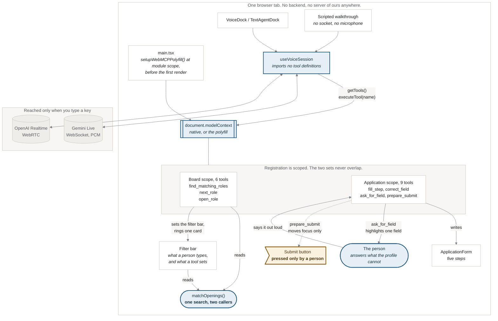

# Architecture

How the voice demo is put together, and the three places the design is load
bearing. `docs/screenshots/voice/architecture.png` is rendered from this file:

    cd tools/screenshots
    node render-diagram.mjs ../../hackathon/agentic-voice-application/docs/architecture.md \
      ../../docs/screenshots/voice/architecture.png

**The polyfill installs at module scope.** React runs child effects before
parent effects, so a polyfill installed in any component's `useEffect` lands
after every descendant has already tried to register and given up. The page then
shows zero imperative tools, silently.

**The voice layer imports no tool definitions.** `useVoiceSession` asks
`document.modelContext.getTools()` and dispatches by name through
`executeTool()`. That indirection is the demo's actual claim: register a tool
anywhere in the app and the agent can call it without the voice code changing.

**The search is visible.** `find_matching_roles` does not just return rows: it
sets the filter bar to what it searched and rings the top result, so what the
agent says and what the person sees are the same search. `next_role` moves the
ring down the shortlist when they are not interested. That is why it is not
marked `readOnlyHint`.

**Two passes, then it asks.** `fill_step` fills what the profile holds and
reports the rest as unanswerable. `ask_for_field` then highlights one of those on
screen so the person can see which question is meant, and `correct_field` writes
what they say. No tool can tick the declaration.

**Nothing submits.** `prepare_submit` moves focus to the button and returns
`submitted: false`. There is no tool that presses it, so no spoken instruction
can, and the accuracy declaration is left unticked because that field has no
source in the profile.
